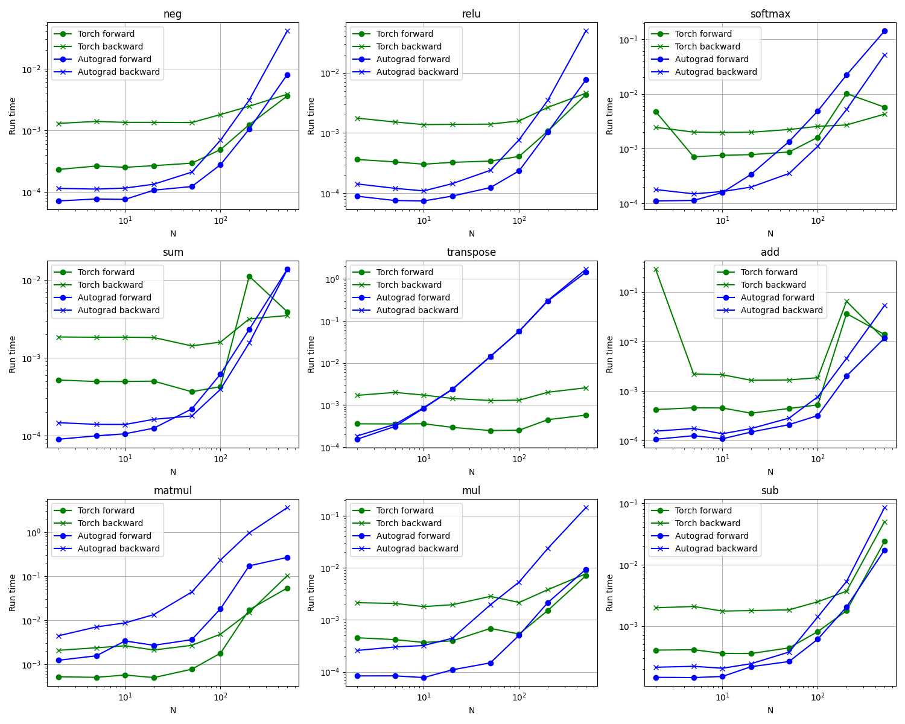

# Autograd in Rust

A tensor library in Rust with pytorch-style autograd and python bindings.

> **Note**: this project is an academic endeavour to learn more about **rust** and **pytorch**. It is in no way a meant to be used in production applications.

## Installation

This project is built using [maturin](https://www.maturin.rs/).

```bash
git clone git@github.com:bastienlc/autograd.git
cd autograd
python -m venv .venv
source .venv/bin/activate
pip install -U pip maturin
maturin develop --release
```

> **Note**: this project uses **nightly** rust (for the feature _mapped_lock_guards_).

## Example usage

```python
import autograd

a = autograd.Tensor([2], [0.1, 0.2], requires_grad=True, grad=None, graph=None)
b = autograd.Tensor([2], [0.3, 0.4], requires_grad=True, grad=None, graph=None)
c = (a + b).reduce_sum()
c.backward(None)

print(c.get_data())  # [1.0]
print(a.get_grad().get_data(), b.get_grad().get_data())  # [1.0, 1.0] [1.0, 1.0]
```

Take a look at [examples/example.py](examples/example.py) for a side-by-side comparison with pytorch on MNIST.

## Performance comparison

We compare our library's performance with torch (default) performance. We consider matrices $A,B\in\mathbb{R}^{(N,N)}$ for different values of $N$, and look at the performance of unary (e.g. `-A`, `A.transpose()`, etc.) and binary (e.g. `A@B`, `A+B`, etc.) operations. For each operations we look at the forward and backward performance (for the backward, we use gradients of ones).

<p align="middle">
  
</p>

> The benchmark is ran with the [profiling script](./examples/profiling.py) on an Intel Core i7-13705H.

For small values of $N$, our library is not that terrible despite not implementing a lot of optimizations (if we make sure to compile it in release mode). This is quite surprising. There's probably a better way to do this performance comparison.

## Implementation details

This is a **rust** project. It uses **pyo3** to get python bindings. The architecture is mainly inspired by pytorch. As such we have a `CoreTensor` object that holds data, a grad and a graph. For easy parallelization without data duplication, we use the rust pattern `Arc<RwLock<CoreTensor>>`, i.e. atomically reference counted tensors with interior mutability. If this doesn't mean anything to you, maybe it's your cue to [learn rust](https://doc.rust-lang.org/book/).

The forward operations are directly implemented on `Tensor`. The backward operations are implemented using a `Backward` trait. For instance the backward operation for the addition looks like this:

```rust
pub struct AddOperation {
    lhs: Tensor,
    rhs: Tensor,
}

impl Backward for AddOperation {
    fn do_backward(&mut self, grad: Option<Tensor>, _: Option<Tensor>) {
        let grad = grad.unwrap();
        self.lhs.do_backward(Some(grad.clone()), None);
        self.rhs.do_backward(Some(grad.clone()), None);
    }
}
```

`AddOperation` will be a node in the graph. When doing the forward, pass, this node will form the result tensor graph.

## Tests

For now we only have tests in python comparing forward/backward of all the operations with pytorch and numpy implementations.

```bash
source .venv/bin/activate
pip install pytest
pytest
```

## TODO

- Add strided tensors for $\mathcal{O}(1)$ transposition.
- Optimize different kernels.
- Add missing utilities (zero_grad, zeros, ones, randn, operations with native pytorch types, etc).
- Add more operations.
- Make implementation details of `Tensor` private.
- Investigate possible memory leak.
- Investigate possible error in some backward implementation.
- Write a real documentation.
